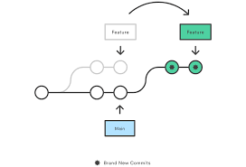

# Git

----

## Initial Setup

```bash
git config --global user.name "<name>"

git config --global user.email <email>
```

----

## SSH Key for Github

Generate the keys by running the following command. Run the command prefferably in an important folder and via thr `Git Bash` Terminal.
> My personal choice for the folder is `~/.ssh`.

```terminal
ssh-keygen -o -t rsa -C <email-address-here>;
```

This will start the Key Generation Process. When prompted, press enter to accept the default values.

Open the SSH Folder in a Text Editor. Copy the `public key` and add it to your GitHub account settings.

You are **All Done** now. Try cloning the repository now.
An error might pop up, but it's fine. For the first time that is completely normal.

----

## Amending Commit Messages

```bash
git commit --amend
```

Opens the Text Editor with the previous commit message. Edit the message and save the file.

----

## Git Large File System

Uses LFS for files in the repository that are larger in size.

### Useage

```terminal
git lfs track <*.extention> or <filename_with_extention>
```

Now `add` and `commit` as normal.

```terminal
git add large_file

git commit -m "Added large file"
```

---

## Merging


```terminal
# Start a new feature
git checkout -b new-feature main
# Edit some files
git add <file>
git commit -m "Start a feature"
# Edit some files
git add <file>
git commit -m "Finish a feature"
# Merge in the new-feature branch
git checkout main
git merge new-feature
git branch -d new-feature
```

The above will work the same if we had a Three-Way Merge.

----

## Rebasing

Rebasing is the process of moving or combining a sequence of commits to a new base commit. Rebasing is most useful and easily visualized in the context of a feature branching workflow.



```terminal
# Create a feature branch based off of main
git checkout -b feature_branch main
# Edit files
git commit -a -m "Adds new feature"

git rebase <base>
# <base> can ben ID, a branch name, a tag, or a relative reference to HEAD

```
